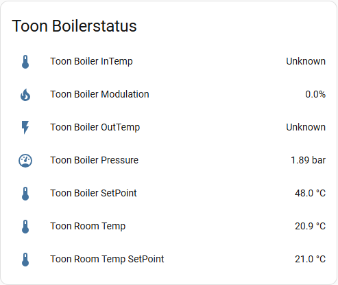

[![GitHub Release][releases-shield]][releases]
[![GitHub Activity][commits-shield]][commits]
[![License][license-shield]](LICENSE)
![Project Maintenance][maintenance-shield]

[](https://www.paypal.me/cyberjunkynl/)
[](https://github.com/sponsors/cyberjunky)

# Toon Boiler Status Custom Integration

A Home Assistant custom integration that monitors OpenTherm boiler data through your rooted Toon thermostat's ketelmodule. Get real-time insights into boiler temperature, pressure, modulation levels, and room temperature.

## Supported Features

Monitor your heating system with these sensors:

- **Toon Boiler SetPoint** - Target water temperature
- **Toon Boiler InTemp** - Return water temperature  
- **Toon Boiler OutTemp** - Supply water temperature
- **Toon Boiler Pressure** - System pressure in bar
- **Toon Boiler Modulation** - Current modulation level
- **Toon Room Temp** - Current room temperature
- **Toon Room Temp SetPoint** - Target room temperature

All sensors are created by default and grouped under a single device for easy management.

## Screenshots



## Requirements

- **Rooted Toon thermostat** (available in the Netherlands and Belgium)
- **ToonStore** installed on your Toon
- **BoilerStatus app** installed via ToonStore

For rooting instructions and app installation, visit the [Eneco Toon Domotica Forum](http://www.domoticaforum.eu/viewforum.php?f=87).

## Installation

### HACS (Recommended)

[](https://my.home-assistant.io/redirect/hacs_repository/?owner=cyberjunky&repository=home-assistant-toon_boilerstatus&category=integration)

Alternatively:

1. Install [HACS](https://hacs.xyz) if not already installed
2. Search for "Toon BoilerStatus" in HACS
3. Click **Download**
4. Restart Home Assistant
5. Add via Settings → Devices & Services

### Manual Installation

1. Copy the `custom_components/toon_boilerstatus` folder to your `<config>/custom_components/` directory
2. Restart Home Assistant
3. Add via Settings → Devices & Services

## Configuration

### Adding the Integration

1. Navigate to **Settings** → **Devices & Services**
2. Click **+ Add Integration**
3. Search for **"Toon Boiler Status"**
4. Enter your configuration:
   - **Host**: Your Toon's IP address
   - **Port**: Default is `80`
   - **Name**: Friendly name prefix (default: "Toon")
   - **Update Interval**: Seconds between updates (default: `10`)

The integration validates your connection and creates all sensors automatically. Disable sensors you don't need via **Settings** → **Devices & Services** → **Toon Boiler Status** → click a sensor → cogwheel icon → "Enable entity" toggle.

### Migrating from YAML

> **Note:** YAML configuration is deprecated as of v2.0.0

If you previously configured this integration in `configuration.yaml`, your settings will be **automatically imported** on your first restart after updating.

**Your old YAML config** (will be migrated):

```yaml
sensor:
  - platform: toon_boilerstatus
    name: Toon
    host: 192.168.1.100
    port: 80
    scan_interval: 10
    resources:  # Ignored - all sensors are now created
      - boilersetpoint
      - boilerintemp
      ...
```

**After migration:**

1. Remove the YAML configuration from `configuration.yaml`
2. Manage all settings via **Settings** → **Devices & Services** → **Toon Boiler Status** → **Configure**
3. Disable unwanted sensors through entity settings

### Modifying Settings

Change integration settings without restarting Home Assistant:

1. Go to **Settings** → **Devices & Services**
2. Find **Toon Boiler Status**
3. Click **Configure** icon
4. Modify name or scan interval
5. Click **Submit**

Changes apply immediately. To enable/disable individual sensors, click on the sensor entity and toggle "Enable entity".

## Advanced Usage

### Automation Example

Monitor boiler status changes:

```yaml
automation:
  - alias: "Alert Low Boiler Pressure"
    trigger:
      - platform: numeric_state
        entity_id: sensor.toon_boiler_pressure
        below: 1.0
    action:
      - service: notify.mobile_app
        data:
          message: "Warning: Boiler pressure is low ({{ states('sensor.toon_boiler_pressure') }} bar)"
```

## Troubleshooting

### Enable Debug Logging

Add to `configuration.yaml`:

```yaml
logger:
  default: info
  logs:
    custom_components.toon_boilerstatus: debug
```

Alternatively, enable debug logging via the UI in **Settings** → **Devices & Services** → **Toon Boiler Status** → **Enable debug logging**:


Restart Home Assistant and check **Settings** → **System** → **Logs** for detailed information.

### Common Issues

**Integration won't connect:**

- Verify your Toon's IP address is correct
- Ensure the BoilerStatus app is installed and running on your Toon
- Check that port 80 is accessible (try visiting `http://YOUR_TOON_IP/boilerstatus/boilervalues.txt` in a browser)

**Old YAML config not migrating:**

- Check Home Assistant logs for import errors
- Verify the YAML syntax is correct
- Manually add via UI if automatic import fails

## Development

Quick-start (from project root):

```bash
python3 -m venv .venv
source .venv/bin/activate
python -m pip install --upgrade pip
pip install -r requirements_lint.txt
./scripts/lint    # runs pre-commit + vulture
# or: ruff check .
# to auto-fix: ruff check . --fix
```

## 💖 Support This Project

If you find this library useful for your projects, please consider supporting its continued development and maintenance:

### 🌟 Ways to Support

- **⭐ Star this repository** - Help others discover the project
- **💰 Financial Support** - Contribute to development and hosting costs
- **🐛 Report Issues** - Help improve stability and compatibility
- **📖 Spread the Word** - Share with other developers

### 💳 Financial Support Options

[](https://www.paypal.me/cyberjunkynl/)
[](https://github.com/sponsors/cyberjunky)

**Why Support?**

- Keeps the project actively maintained
- Enables faster bug fixes and new features
- Supports testing infrastructure and CI/CD
- Shows appreciation for development time

Every contribution, no matter the size, makes a difference and is greatly appreciated! 🙏

## License

This project is licensed under the MIT License - see the [LICENSE](LICENSE) file for details.

---

[releases-shield]: https://img.shields.io/github/release/cyberjunky/home-assistant-toon_boilerstatus.svg?style=for-the-badge
[releases]: https://github.com/cyberjunky/home-assistant-toon_boilerstatus/releases
[commits-shield]: https://img.shields.io/github/commit-activity/y/cyberjunky/home-assistant-toon_boilerstatus.svg?style=for-the-badge
[commits]: https://github.com/cyberjunky/home-assistant-toon_boilerstatus/commits/main
[license-shield]: https://img.shields.io/github/license/cyberjunky/home-assistant-toon_boilerstatus.svg?style=for-the-badge
[maintenance-shield]: https://img.shields.io/badge/maintainer-cyberjunky-blue.svg?style=for-the-badge
